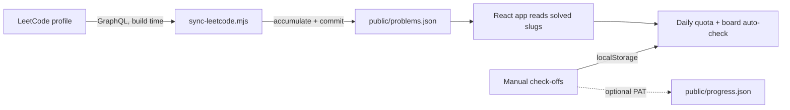

# 🧠 Mission Frontier

A personal, self-updating tracker for a focused **3-month OpenAI Residency prep** sprint — a mission to reach the frontier of AI research. It turns a big, vague goal ("get ready for the Residency") into a dated plan you can actually execute against — and the LeetCode part checks itself off from your real submissions.

> **Recruiter TL;DR**
> - A single dashboard that tracks six prep tracks at once: LeetCode, math, from-scratch builds, production coding, brain teasers, and timed mock interviews — against a dated 13-week plan.
> - The hardest part solved: the LeetCode board **auto-syncs from a public LeetCode profile at build time** (no official API) via an accumulating GraphQL sync committed back by CI, so solving a problem on LeetCode auto-completes it here.
> - Built with the same stack and deploy pipeline as its sibling trackers (Vite + React + TS + Tailwind → GitHub Pages), fully static, no backend.

Live: `https://shiva-shivanibokka.github.io/mission-frontier/` (once Pages is enabled)

---

## What it tracks

| Track | What it does |
|---|---|
| **Today’s Quota** | The 3 scheduled LeetCode problems for the current date; fills itself in as you solve them |
| **LeetCode · NeetCode 150** | The full 150 grouped by pattern, with per-pattern progress. Auto-checked from your LeetCode |
| **Math** | Probability, linear algebra, matrix calculus, information theory — with curated resources |
| **Build From Scratch** | Autograd + optimizers flagship → GPT reproduction → an original grokking study, each with checkable steps + papers |
| **Production Coding** | Clean components + ML-from-scratch drills (LRU, BPE, All-Reduce, logistic regression, …) |
| **Brain Teasers** | 12 classics for the mentor round, with reveal-on-click hints |
| **Timed Tests** | 12 dated mock tests with time limits so you rehearse under the real interview clock |
| **Interview Rounds** | The actual Residency loop (OA → live coding → 4-hr research → mentor → hiring manager) with prep notes |

The three-phase roadmap (Foundations → Depth → Original work + full mock loop) highlights the phase you’re currently in based on today’s date.

## How the auto-sync works

LeetCode exposes no official API and only returns your ~20 most recent accepted submissions. So `scripts/sync-leetcode.mjs` runs as an **accumulator**: on a schedule (and every push) the GitHub Action fetches recent solves, merges any new ones into `public/problems.json`, and commits the file back. The app reads that file and marks any scheduled problem whose `titleSlug` appears there as done — automatically. Manual checkboxes cover everything that isn’t on LeetCode (math, builds, tests, etc.).



## Tech stack

Vite 5 · React 18 · TypeScript 5 (strict) · Tailwind CSS 3 · Canvas for the animated multi-color circuit background · GitHub Actions → GitHub Pages. No backend, no database — fully static.

## Skills demonstrated

- Turning an ambiguous goal into a **dated, data-driven plan** rendered from typed data files.
- Working around a **no-API data source** with a CI-side accumulator that commits results back to the repo.
- Client state that layers **localStorage over a committed baseline**, with optional GitHub-Contents-API persistence via a user-supplied fine-grained token (stored only in the browser).
- Accessible, reduced-motion-aware canvas animation.

## Getting started

```bash
npm install
npm run dev        # local dev server
npm run sync       # pull latest solved problems into public/problems.json
npm run build      # type-check + production build
```

Set the LeetCode handle via `--user` or the `LEETCODE_USERNAME` env var (defaults to the owner’s handle).

## Project structure

```
src/
  data/        plan constants, NeetCode-150 list, schedule builder, all track data
  lib/         progress store (localStorage + baseline) and GitHub commit helper
  components/  circuit background, header, tiles, roadmap, and each track section
scripts/       sync-leetcode.mjs (accumulating GraphQL sync)
public/        problems.json (LeetCode, CI-updated) · progress.json (manual check-offs)
.github/       deploy.yml (sync + build + Pages, on push and a 6-hourly cron)
```

## Testing

No automated tests yet — this is a personal single-user tracker. Correctness is verified by type-checking (`npm run lint`) and a production build.

## Deployment

GitHub Actions builds on every push and on a 6-hourly cron (which also refreshes the LeetCode sync), then deploys `dist/` to GitHub Pages. Enable Pages → “GitHub Actions” in the repo settings once.

## Notes & honesty

- The **countdown target** (`TARGET_DATE`) is an approximate interview window; update it when real dates are known.
- The LeetCode backbone is the **NeetCode 150** — the "main parts" for the core 3 months; extend the list in `src/data/leetcode.ts` afterward.
- No fabricated stats: every number on the page is computed from your actual data or from checkboxes you tick.

## License

No license specified — personal project.
